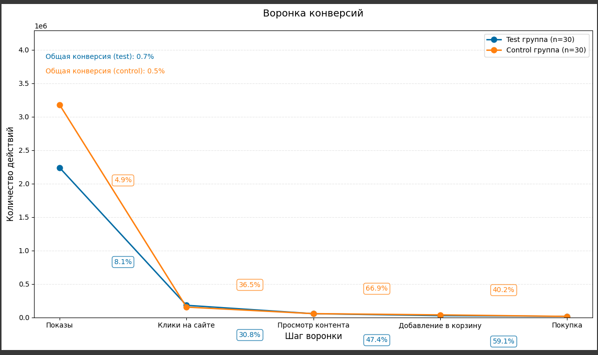

# A/B-тест: Оценка изменений в рекламной кампании

**Цель:** Проверить, приводит ли изменение креатива рекламы к статистически значимому росту конверсии в покупки.

## 🔍 Основные выводы
- **Статистическая значимость:** Тест показал снижение конверсии на **1.18% (p < 0.001)**.
- **Размер эффекта:** Крайне мал (Cohen's h = -0.007).
- **Мощность теста:** Всего **5.3%** при требуемых 80%.
- **Проблема:** Недостаточный размер выборки (30 наблюдений vs требуемые 3,835 на группу).
- **Рекомендация:** 
  - Перезапустить тест с достаточным объемом данных.
  - Пересмотреть гипотезу, если эффект не имеет практической ценности.

## 📊 Данные и метрики
**Источник данных:** Рекламная кампания в Facebook (тестовая и контрольная группы).  
**Анализируемые метрики:**
- Конверсия: `purchase / website_clicks`
- Цена действия: `spend_usd / purchase`
- Кликабельность: `website_clicks / impressions`

## ⚙️ Технологии
- Python: `pandas`, `scipy`, `statsmodels`, `matplotlib`
- Методы:
  - Z-тест пропорций
  - Расчет мощности теста
  - Визуализация воронки конверсий

## 📈 Ключевой график
  
*Различия в конверсии между группами на каждом этапе*

## 🛠 Как запустить анализ
1. Установите зависимости:
   ```bash
   pip install pandas numpy scipy statsmodels matplotlib seaborn
